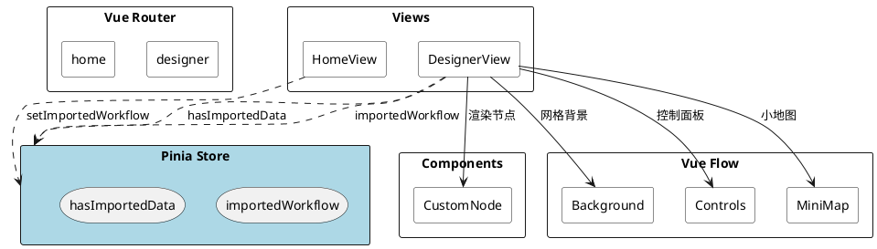
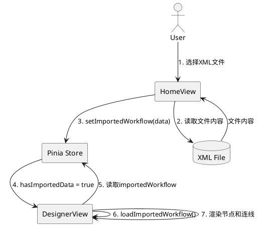
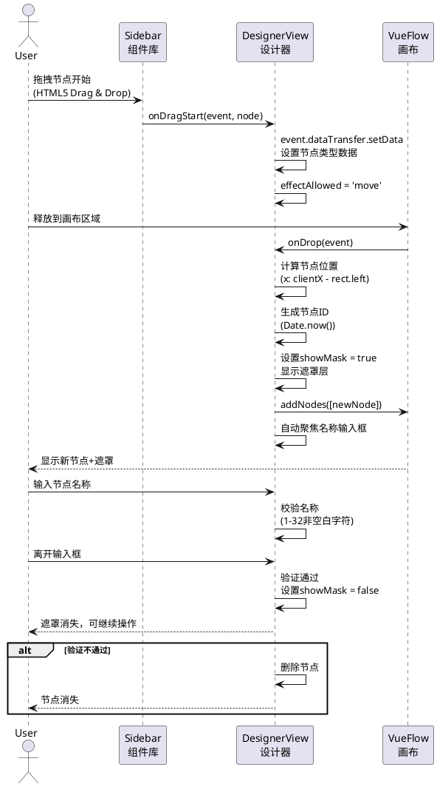
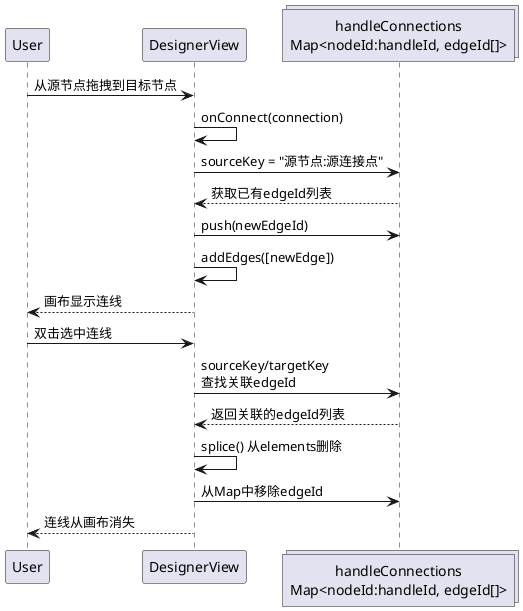
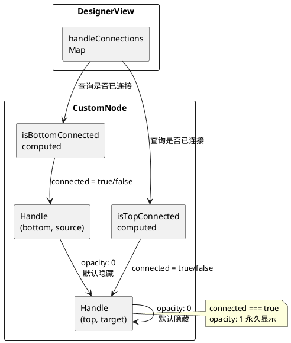
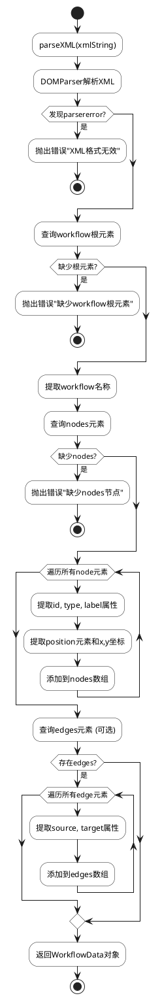
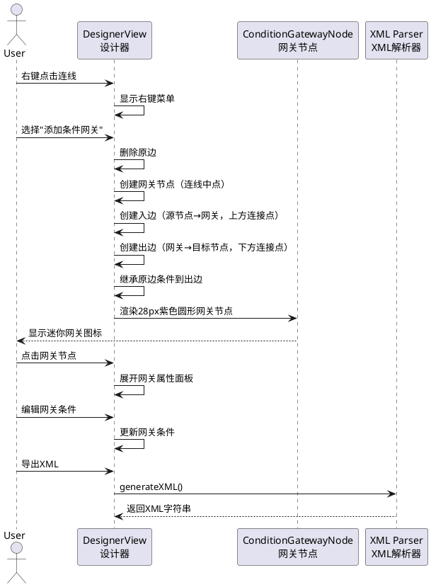
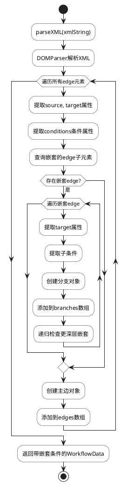

# 工作流设计器 (Workflow Designer)

一个基于 Vue.js 3 + TypeScript + Vite 的可视化工作流编排系统。

## 功能特性

### 📋 首页功能
- **新建工作流** - 创建空白工作流设计
- **导入工作流** - 从 XML 文件导入已有设计
- 响应式卡片布局，支持移动端适配

### 🎨 设计器核心功能

#### 节点操作
- **拖拽添加节点** - 从左侧组件库拖拽节点到画布
- **节点类型**：
  - 子流程节点 (绿色) ⚙️
  - 接口调用节点 (橙色) 🔗
  - 接口循环调用节点 (蓝色) 🔄
- **条件网关节点** (紫色) ◇ - 用于条件分支
- **节点属性编辑** - 点击节点可在右侧面板编辑名称
- **自定义节点样式** - 统一的节点外观设计

#### 节点名称规则
- **必填名称** - 创建节点时必须输入名称，不输入则节点会被删除
- **名称校验** - 名称为1-32个非空白字符
- **实时同步** - 在右侧属性栏修改名称时，画布上的节点实时更新
- **节点类型** - 类型由创建时决定，不可修改
- **默认尺寸** - 节点最小尺寸 120x50，避免输入名称后变形

#### 首次创建流程
1. 从左侧拖拽节点到画布
2. 自动展开右侧属性编辑栏
3. 名称输入框自动聚焦
4. 画布显示遮罩，引导您输入名称
5. 输入有效名称（1-32个非空白字符）后遮罩消失
6. 如不输入名称就离开，节点自动删除

#### 连线功能
- **直线连接** - 节点间使用直线连接
- **黑色箭头** - 连线终点带有方向箭头
- **智能连接点显示**：
  - 默认隐藏所有连接点
  - 鼠标悬浮到具体连接点时才显示
  - 连线成功后该连接点永久显示
  - 删除所有连线后自动隐藏
- **删除连线** - 双击连线即可删除
- **连线规则**：
  - 同一连接点最多只能有一条连线（无论是作为起点还是终点）
  - 两个节点之间只能有一条连线（不支持双向连接）

#### 条件配置
- **Status 条件** - 根据 HTTP 状态码匹配
- **参数条件** - 根据返回参数值匹配
- **操作符支持**：
  - `=` 等于
  - `≠` 不等于
  - `⊆` 包含
  - `~` 正则匹配
- **优先级** - 数字越小优先级越高 (0-10)

#### 条件网关 (Conditional Gateway)
- **添加条件网关** - 右键点击连线 → "添加条件网关"
- **迷你网关设计** - 28x28px 紫色圆形节点，最小化视觉干扰
- **连接点布局**：
  - **上方**：入边连接点（target，接收源节点连线）
  - **下方**：出边连接点（source，连接目标节点）
- **兼容转换**：删除原边，重新建立源→网关→目标的连线结构
- **条件继承**：原连线条件自动继承到网关出边
- **可视化** - 紫色网关节点，清晰展示条件分支结构

#### 条件网关使用流程
1. 创建两个节点并连接
2. 右键点击连线，选择"添加条件网关"
3. 系统自动：
   - 删除原连线
   - 在连线中点创建紫色圆形网关节点
   - 创建入边：源节点 → 网关（上方连接点）
   - 创建出边：网关 → 目标节点（下方连接点，继承原条件）
4. 在右侧面板编辑网关条件

#### 画布操作
- **缩放控制** - 支持拖拽缩放和平移
- **网格背景** - 便于节点定位对齐
- **小地图** - 快速导航大型工作流
- **控制面板** - 缩放、重置视角等操作
- **遮罩状态管理**：
  - 编辑状态下显示遮罩，阻止其他操作
  - 遮罩状态下禁用所有画布操作（拖拽、连线、点击等）
  - 点击画布空白处可取消编辑状态

### 💾 数据持久化

#### XML 导出
- 导出完整工作流定义
- 包含节点、位置、连线信息
- 支持导入恢复设计

#### XML 导入
- 解析标准格式的 XML 文件
- 恢复节点位置和连线关系
- 支持增量开发工作流

## 技术栈

- **前端框架**: Vue.js 3 (Composition API)
- **构建工具**: Vite 5
- **语言**: TypeScript
- **状态管理**: Pinia
- **路由**: Vue Router
- **图形库**: Vue Flow
- **样式**: Tailwind CSS 3
- **包管理**: npm

## 快速开始

### 安装依赖

```bash
npm install
```

### 启动开发服务器

```bash
npm run dev
```

访问 http://localhost:5173

### 构建生产版本

```bash
npm run build
```

## 项目结构

```
workflow-designer/
├── src/
│   ├── assets/
│   │   ├── main.css          # 全局样式
│   │   └── vueflow.css      # Vue Flow 自定义样式
│   ├── components/
│   │   ├── CustomNode.vue    # 自定义节点组件
│   │   └── ConditionGatewayNode.vue  # 条件网关节点组件 ⭐ 新增
│   ├── router/
│   │   └── index.ts          # 路由配置
│   ├── stores/
│   │   └── workflow.ts       # 工作流状态管理
│   ├── utils/
│   │   └── xmlParser.ts     # XML 解析工具 (支持嵌套条件) ⭐ 已更新
│   ├── views/
│   │   ├── HomeView.vue     # 首页
│   │   └── DesignerView.vue  # 设计器页面 (支持条件网关) ⭐ 已更新
│   ├── App.vue
│   └── main.ts
├── index.html
├── package.json
├── tsconfig.json
├── vite.config.ts
└── README.md
```

## 使用说明

### 创建工作流

1. 点击首页的"新建工作流"卡片
2. 进入空白设计画布
3. 从左侧组件库拖拽节点到画布
4. 在右侧属性栏输入节点名称（必填，1-32个非空白字符）
5. 拖拽连接点创建连线
6. 点击节点可编辑属性

### 节点名称规则

- 首次拖拽节点到画布时，必须输入节点名称
- 名称不能为空或全空白字符
- 名称长度限制为1-32个字符
- 如果不输入名称就离开输入框，节点会被自动删除

### 导入工作流

1. 点击首页的"导入工作流"卡片
2. 选择 XML 文件
3. 自动加载工作流设计

### 导出工作流

1. 在设计器页面点击"导出 XML"按钮
2. 保存 XML 文件到本地
3. 可用于备份或分享

### 使用条件网关

#### 创建条件网关

1. 创建两个节点（如：开始节点 → 处理节点）
2. 将它们连接起来
3. 右键点击连线
4. 选择"添加条件网关"
5. 系统会在原连线位置创建一个紫色网关节点，并将原连线替换为：
   - 源节点 → 网关（上方入边）
   - 网关 → 目标节点（下方出边，继承原条件）

#### 编辑网关条件

1. 点击条件网关节点
2. 在右侧面板可编辑条件配置

### 条件规则说明

- **条件组合**：Status 条件和参数条件默认使用"且"逻辑
- **优先级**：
  - 优先级数字越小，匹配优先级越高 (0-10)
  - 默认优先级为 10
- **参数验证**：
  - 如果参数值为空，参数名可以为空
  - 如果参数值不为空，参数名必须填写

## 界面预览

### 首页
- 渐变紫色背景
- 两个功能卡片并排显示
- 现代化简洁设计

### 设计器
- 三栏布局：组件库 | 画布 | 属性编辑（默认隐藏）
- 拖拽节点后自动展开右侧属性栏
- 首次创建时画布显示遮罩，引导输入名称
- 悬浮显示连接点
- 黑色箭头连线
- 流畅的动画效果

### 节点名称输入
- 创建节点后自动聚焦到名称输入框
- 名称校验提示：名称为1-32个非空白字符
- 不输入有效名称无法进行其他操作

### 条件网关界面
- **迷你网关节点** - 28x28px 紫色圆形设计，最小化视觉干扰
- **连接点布局** - 上方入边（target），下方出边（source）
- **连线结构** - 源节点 → 网关 → 目标节点（兼容转换，继承条件）
- **右键菜单** - 便捷的上下文操作

## 浏览器兼容性

- Chrome (推荐)
- Edge
- Firefox
- Safari

## 更新日志

### v2.2 - 条件网关优化 (2026-02-11)

#### 功能改进

**1. 操作重命名**
- "转换为条件网关" → "添加条件网关"
- 右键菜单文案同步更新

**2. 连接点简化**
- 从 7 个连接点简化为 **2 个连接点**
- **上方连接点** (target)：接收源节点的连线
- **下方连接点** (source)：连接目标节点
- 移除分支连接点设计

**3. 连线转换兼容优化**
- **删除原边**：添加条件网关时删除原连线
- **重建连线**：源节点 → 网关 → 目标节点
- **条件继承**：原边条件自动继承到网关出边
- **handleId 更新**：
  - 入边：`targetHandle: 'top'`
  - 出边：`sourceHandle: 'bottom'`

**4. 响应式状态修复**
- 直接操作 `edges.value` 数组确保 Vue 响应式更新
- 添加 `updateNodeInternals()` 强制更新节点内部状态
- 修复标签显示问题

#### 关键文件修改
- `ConditionGatewayNode.vue` - 连接点简化为上下布局
- `DesignerView.vue` - 条件网关创建逻辑优化，按钮重命名

#### 新布局示意
```
  源节点 (Source)
       │
       ▼ (targetHandle: 'top')
  ┌─────────┐
  │ ◇ 网关  │  ← 上方连接点 (target)
  └─────────┘
       │ (sourceHandle: 'bottom')
       ▼
  目标节点 (Target)
```

---

### v2.1 - 条件网关功能优化 (2026-02-10)

#### 功能改进

**1. 条件网关界面优化**
- **尺寸优化**：网关节点从 140x60px 缩小至 20x20px（圆形），最小化视觉干扰
- **连接点布局**：改为左入右出 + 上下分支布局
  - 左侧：入边连接点（接收源节点连线）
  - 右侧：出边连接点（连接目标节点）
  - 上下两侧：5个分支连接点（交替分布）

**2. 连线条件嵌套方案优化**
- **保留原连线**：创建条件网关时，原连线保留作为默认条件边
- **条件继承**：原连线的所有条件自动继承到默认分支
- **中间锚点**：网关作为源节点和目标节点的中间锚点，形成：源节点 → 网关 → 目标节点

**3. 遮罩状态管理增强**
- **操作限制**：遮罩状态下禁用所有画布操作
  - 禁止拖拽添加节点
  - 禁止点击节点/连线
  - 禁止创建新连线
  - 禁止右键菜单操作
  - 禁止双击删除连线
- **智能取消**：创建节点后未输入或输入不合法时点击画布，自动删除该节点并取消遮罩

**4. 编辑状态管理统一**
- 新增 `clearAllEditingStates` 统一函数，管理所有编辑状态和遮罩
- 修复编辑栏显示/隐藏逻辑
- 优化节点创建流程的状态管理

#### 技术实现

**关键文件修改**：
- `ConditionGatewayNode.vue` - 节点尺寸缩小，连接点布局调整
- `DesignerView.vue` - 条件网关创建逻辑重构，遮罩状态管理优化
- 类型定义更新，确保类型安全

#### 使用流程更新

1. 创建两个节点并连接
2. 右键点击连线，选择"转换为条件网关"
3. 系统自动：
   - 在连线中点创建 20px 紫色圆形网关节点
   - 保留原连线作为出边（继承所有条件）
   - 创建入边连接源节点到网关
4. 在右侧面板编辑条件
5. 从网关上下分支点拖拽创建新分支

---

## 许可证

MIT License

---

## 代码设计实现

### 技术架构



### 数据流设计



### XML 数据格式

#### 导出 XML 结构

```xml
<?xml version="1.0" encoding="UTF-8"?>
<workflow name="工作流名称">
  <nodes>
    <node id="节点ID" type="节点类型" label="节点标签">
      <position x="横坐标" y="纵坐标"/>
    </node>
    ...
  </nodes>
  <edges>
    <edge id="e0" source="源节点ID" target="目标节点ID"/>
    ...
  </edges>
</workflow>
```

#### 节点类型映射

| 类型 | 类型值 | 颜色 | 图标 |
|------|--------|------|------|
| 子流程 | `subprocess` | `#10b981` (绿色) | ⚙️ |
| 接口调用 | `api` | `#f59e0b` (橙色) | 🔗 |
| 接口循环调用 | `api-loop` | `#3b82f6` (蓝色) | 🔄 |
| 条件网关 | `condition-gateway` | `#8b5cf6` (紫色) | ◇ |

#### 条件网关 XML 结构 ⭐ 新功能

```xml
<?xml version="1.0" encoding="UTF-8"?>
<workflow name="工作流名称">
  <nodes>
    <!-- 条件网关节点 -->
    <node id="gateway-e0" type="condition-gateway" label="条件网关"
          statusValue="200"
          paramName="result"
          paramOperator="eq"
          paramValue="success">
      <position x="300" y="200"/>
    </node>
    <!-- 普通节点 -->
    <node id="n1" type="api" label="开始节点">
      <position x="100" y="200"/>
      <interfaceName>startProcess</interfaceName>
    </node>
  </nodes>
  <edges>
    <!-- 主边：源节点到网关 -->
    <edge id="e0" source="n1" target="gateway-e0"/>
    
    <!-- 带分支的边：网关到目标节点 -->
    <edge id="e1" source="gateway-e0" target="n2"
          statusValue="200"
          paramName="result"
          paramOperator="eq"
          paramValue="success">
      <!-- 分支1：成功分支 -->
      <edge target="n3"
            paramName="code"
            paramOperator="regex"
            paramValue="^20"/>
      <!-- 分支2：失败分支 -->
      <edge target="n4"
            statusValue="500"/>
    </edge>
  </edges>
</workflow>
```

#### 分支嵌套示例 ⭐ 新功能

```xml
<?xml version="1.0" encoding="UTF-8"?>
<workflow name="嵌套条件示例">
  <nodes>
    <node id="start" type="api" label="开始">
      <position x="100" y="100"/>
      <interfaceName>start</interfaceName>
    </node>
    <node id="process" type="api" label="处理">
      <position x="400" y="100"/>
      <interfaceName>process</interfaceName>
    </node>
  </nodes>
  <edges>
    <!-- 主边带嵌套分支 (最多3层) -->
    <edge id="e0" source="start" target="process" priority="0"
          statusValue="200">
      <!-- 第1层分支 -->
      <edge target="branch1" paramName="type" paramOperator="eq" paramValue="A">
        <!-- 第2层嵌套分支 -->
        <edge target="branch1-1" paramName="subType" paramOperator="eq" paramValue="A1">
          <!-- 第3层嵌套分支 (最大层数) -->
          <edge target="branch1-1-1" paramName="detail" paramOperator="eq" paramValue="X"/>
        </edge>
        <edge target="branch1-2" paramName="subType" paramOperator="eq" paramValue="A2"/>
      </edge>
      <!-- 第1层分支2 -->
      <edge target="branch2" paramName="type" paramOperator="eq" paramValue="B"/>
    </edge>
  </edges>
</workflow>
```

#### 完整 XML 示例

```xml
<?xml version="1.0" encoding="UTF-8"?>
<workflow name="审批流程">
  <nodes>
    <node id="1709900000001" type="api" label="提交申请">
      <position x="250" y="50"/>
      <interfaceName>submitApplication</interfaceName>
    </node>
    <node id="1709900000002" type="api-loop" label="审批">
      <position x="250" y="150"/>
      <interfaceName>approve</interfaceName>
      <collectionName>approvals</collectionName>
    </node>
    <node id="gateway-1" type="condition-gateway" label="审批结果">
      <position x="250" y="280"/>
    </node>
    <node id="1709900000003" type="api" label="结束流程">
      <position x="250" y="420"/>
      <interfaceName>finishProcess</interfaceName>
    </node>
  </nodes>
  <edges>
    <edge id="e0" source="1709900000001" target="1709900000002"/>
    <edge id="e1" source="1709900000002" target="gateway-1" priority="0"
          statusValue="200"/>
    <!-- 带分支的条件边 -->
    <edge id="e2" source="gateway-1" target="1709900000003" priority="0"
          statusValue="200">
      <edge target="approved-node" paramName="result" paramOperator="eq" paramValue="approved"/>
      <edge target="rejected-node" paramName="result" paramOperator="eq" paramValue="rejected"/>
    </edge>
  </edges>
</workflow>
```

### 核心实现逻辑

#### 1. 拖拽节点实现



#### 2. 节点名称校验

```plantuml
@startuml
skinparam backgroundColor white
skinparam ActivityBackgroundColor white

start
:创建节点后\nshowMask = true
:自动聚焦名称输入框

while (用户输入中?) is (未输入)
  :显示遮罩\n阻止其他操作
endwhile (开始输入)

:hasStartedTyping = true
:显示校验规则提示
:名称为1-32个非空白字符

if (输入框失去焦点?) then (是)
  :检查名称有效性
  if (名称有效?) then (是)
    :清除遮罩
    :hasStartedTyping = false
    :允许其他操作
  else (否)
    :延迟10ms
    :删除节点
    :清除遮罩
  endif
endif

stop
@enduml
```

#### 3. 连线状态管理



#### 4. 连接点智能显示



#### 5. XML 解析流程



### 组件通信

#### HomeView → DesignerView 数据传递

1. **HomeView** 选择 XML 文件后
2. 调用 `parseXML()` 解析 XML 字符串
3. 调用 `workflowStore.setImportedWorkflow(data)` 存储到 Pinia
4. 路由跳转到 `/designer`
5. **DesignerView** `onMounted` 时检查 `workflowStore.hasImportedData`
6. 调用 `loadImportedWorkflow()` 恢复画布状态
7. 调用 `clearImportedWorkflow()` 防止刷新重复加载

#### 关键文件职责

| 文件 | 职责 |
|------|------|
| `HomeView.vue` | 首页入口，XML文件选择与解析 |
| `DesignerView.vue` | 设计器主页面，节点拖拽、连线、条件网关、导出、名称校验 |
| `CustomNode.vue` | 自定义节点组件，连接点显示逻辑 |
| `ConditionGatewayNode.vue` | ⭐ 条件网关节点组件，支持多分支显示 |
| `workflow.ts` | Pinia状态管理，跨页面数据传递 |
| `xmlParser.ts` | XML解析与导出，支持嵌套条件边 |
| `router/index.ts` | 路由配置，双页面应用 |

#### 条件网关相关组件

```
ConditionGatewayNode.vue
├── Props:
│   ├── id: string              # 网关节点ID
│   ├── label: string           # 显示名称
│   ├── color?: string          # 节点颜色 (默认紫色)
│   └── conditions?: {...}      # 主条件配置
├── Template:
│   ├── 网关图标 (◇)
│   ├── 上方连接点 (top, target)  # 接收源节点连线
│   └── 下方连接点 (bottom, source) # 连接目标节点
└── 样式:
    ├── 28x28px 圆形设计
    ├── 紫色背景 (#8b5cf6)
    ├── 白色边框
    └── 悬浮显示连接点
```

### 条件网关实现逻辑



### 嵌套条件解析流程 ⭐ 新功能



### 样式设计

#### 首页渐变背景

- 渐变色彩：从紫蓝色 (#667eea) 到深紫色 (#764ba2)
- 渐变角度：135度对角线

#### 节点颜色系统

| 类型 | 颜色代码 | 色彩 |
|------|----------|------|
| 子流程 | `#10b981` | 绿色 |
| 接口调用 | `#f59e0b` | 橙色 |
| 接口循环调用 | `#3b82f6` | 蓝色 |
| 条件网关 | `#8b5cf6` | 紫色 ⭐ 新增 |
| 条件网关边框 | `#7c3aed` | 深紫色 ⭐ 新增 |

#### 节点默认尺寸

- 最小宽度：120px
- 最小高度：50px
- 内边距：10px 20px
- 设计目的：避免输入名称后节点变形

#### 条件网关节点样式

| 属性 | 值 | 说明 |
|------|-----|------|
| 尺寸 | 28px × 28px | 圆形设计，最小化视觉干扰 |
| 背景色 | `#8b5cf6` (紫色) | 醒目标识 |
| 边框色 | rgba(255,255,255,0.6) | 白色半透明边框 |
| 图标 | ◇ | 居中显示 |
| 图标颜色 | rgba(255,255,255,0.95) | 高对比度白色 |
| 阴影 | 0 2px 4px rgba(0,0,0,0.2) | 轻微阴影增强层次 |
| 悬浮效果 | 放大1.1倍 + 加深阴影 | 交互反馈 |
| 连接点尺寸 | 8px | 上下两个连接点 |

#### 连线样式

- 连接线类型：直线 (straight)
- 连线颜色：黑色 (#000000)
- 线宽：2px
- 箭头类型：实心箭头 (arrow)
  - 箭头颜色：黑色 (#000000)

---

## 新功能更新日志

### v2.2 - 条件网关优化 (2026-02-11)

#### 功能改进

**1. 操作重命名**
- "转换为条件网关" → "添加条件网关"
- 右键菜单文案同步更新

**2. 连接点简化**
- 从 7 个连接点简化为 **2 个连接点**
- **上方连接点** (target)：接收源节点的连线
- **下方连接点** (source)：连接目标节点
- 移除分支连接点设计

**3. 连线转换兼容优化**
- **删除原边**：添加条件网关时删除原连线
- **重建连线**：源节点 → 网关 → 目标节点
- **条件继承**：原边条件自动继承到网关出边
- **handleId 更新**：
  - 入边：`targetHandle: 'top'`
  - 出边：`sourceHandle: 'bottom'`

**4. 响应式状态修复**
- 直接操作 `edges.value` 数组确保 Vue 响应式更新
- 添加 `updateNodeInternals()` 强制更新节点内部状态
- 修复标签显示问题

#### 关键文件修改
- `ConditionGatewayNode.vue` - 连接点简化为上下布局
- `DesignerView.vue` - 条件网关创建逻辑优化，按钮重命名

---

### v2.1 - 条件网关功能优化 (2026-02-10)

#### 功能改进

**1. 条件网关界面优化**
- **尺寸优化**：网关节点从 140x60px 缩小至 20x20px（圆形），最小化视觉干扰
- **连接点布局**：改为左入右出 + 上下分支布局
  - 左侧：入边连接点（接收源节点连线）
  - 右侧：出边连接点（连接目标节点）
  - 上下两侧：5个分支连接点（交替分布）

**2. 连线条件嵌套方案优化**
- **保留原连线**：创建条件网关时，原连线保留作为默认条件边
- **条件继承**：原连线的所有条件自动继承到默认分支
- **中间锚点**：网关作为源节点和目标节点的中间锚点，形成：源节点 → 网关 → 目标节点

**3. 遮罩状态管理增强**
- **操作限制**：遮罩状态下禁用所有画布操作
  - 禁止拖拽添加节点
  - 禁止点击节点/连线
  - 禁止创建新连线
  - 禁止右键菜单操作
  - 禁止双击删除连线
- **智能取消**：创建节点后未输入或输入不合法时点击画布，自动删除该节点并取消遮罩

**4. 编辑状态管理统一**
- 新增 `clearAllEditingStates` 统一函数，管理所有编辑状态和遮罩
- 修复编辑栏显示/隐藏逻辑
- 优化节点创建流程的状态管理

#### 技术实现

**关键文件修改**：
- `ConditionGatewayNode.vue` - 节点尺寸缩小，连接点布局调整
- `DesignerView.vue` - 条件网关创建逻辑重构，遮罩状态管理优化
- 类型定义更新，确保类型安全

#### 使用流程更新

1. 创建两个节点并连接
2. 右键点击连线，选择"转换为条件网关"
3. 系统自动：
   - 在连线中点创建 20px 紫色圆形网关节点
   - 保留原连线作为出边（继承所有条件）
   - 创建入边连接源节点到网关
4. 在右侧面板编辑条件
5. 从网关上下分支点拖拽创建新分支

#### 新增功能
- **条件网关节点** - 支持条件分支的可视化网关
- **嵌套条件** - 最多支持 3 层条件嵌套
- **分支管理** - 每个网关最多 5 个分支
- **条件继承** - 分支可继承网关主条件
- **右键菜单** - 便捷的条件网关创建操作

#### 新增组件
- `ConditionGatewayNode.vue` - 条件网关节点组件

#### 更新文件
- `xmlParser.ts` - 支持嵌套条件 XML 解析和生成
- `DesignerView.vue` - 条件网关创建和管理界面
- `CustomNode.vue` - 增强连接点显示逻辑

#### XML 数据类型扩展

```typescript
// 操作符类型
type ConditionOperator = 'eq' | 'ne' | 'contains' | 'regex'

// 条件配置
interface EdgeConditionConfig {
  statusValue?: string    // Status 条件值
  paramName?: string      // 参数名
  paramOperator?: ConditionOperator  // 关系
  paramValue?: string     // 参数值
}

// 分支配置
interface ConditionBranch {
  id: string
  targetNodeId: string
  conditions: EdgeConditionConfig
  priority?: number
}

// 主边数据（支持嵌套条件）
interface EdgeData {
  id: string
  source: string
  target: string
  priority?: number
  conditions?: EdgeConditionConfig
  branches?: ConditionBranch[]
}

// 条件网关节点
interface NodeData {
  id: string
  type: string
  label: string
  position: { x: number; y: number }
  // ... 其他属性
  isConditionGateway?: boolean
  gatewayConditions?: EdgeConditionConfig
}
```

#### 使用限制
- 最大嵌套层数：3 层
- 每个网关最大分支数：5 个
- 每个分支最小保留数：1 个
- 优先级范围：0-10（数字越小优先级越高）

#### 操作符显示映射

| 操作符 | XML属性值 | 显示符号 |
|--------|----------|----------|
| 等于 | `eq` | = |
| 不等于 | `ne` | ≠ |
| 包含 | `contains` | ⊆ |
| 正则匹配 | `regex` | ~ |
