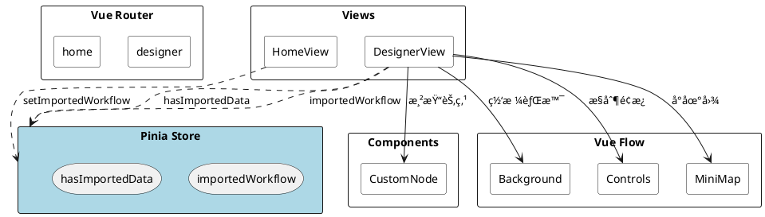
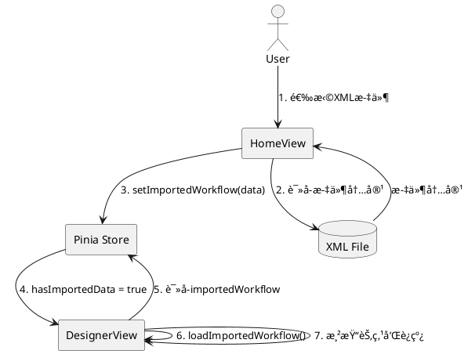
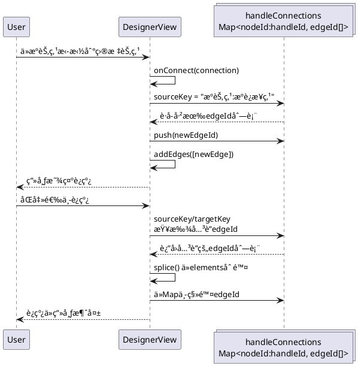
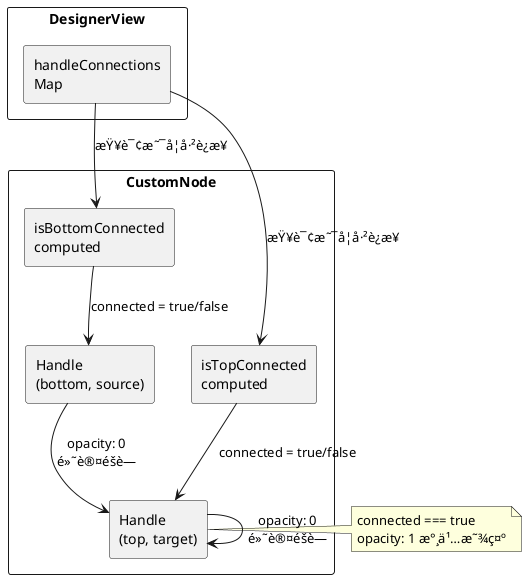
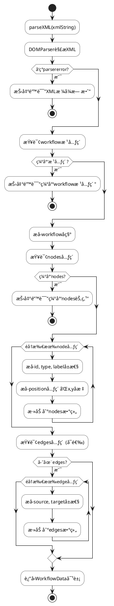
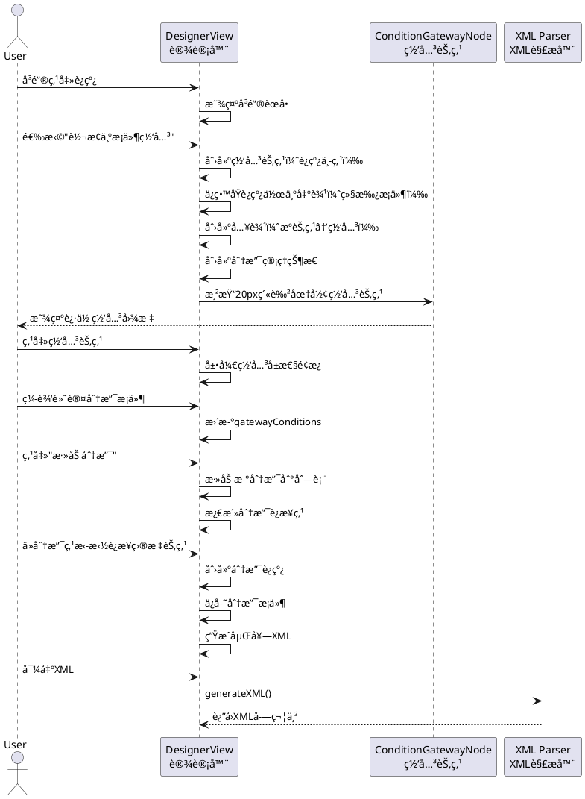
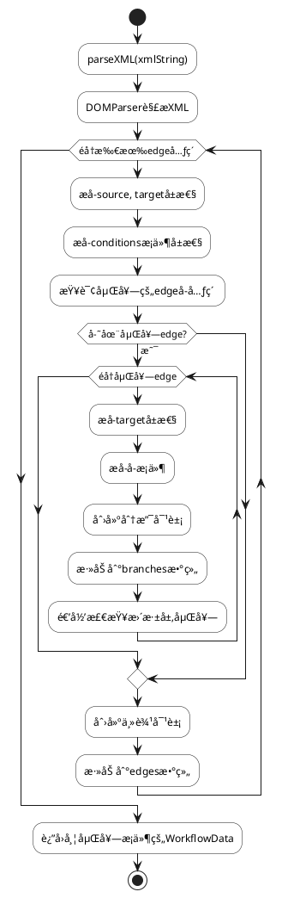

# 工作æµè®¾è®¡å™¨ (Workflow Designer)

ä¸€ä¸ªåŸºäº Vue.js 3 + TypeScript + Vite çš„å¯è§†åŒ–工作æµç¼–æ’系统。

## 功能特性

### 📋 首页功能
- **新建工作æµ** - 创建空白工作æµè®¾è®¡
- **导入工作æµ** - ä» XML 文件导入已有设计
- å“应å¼å¡ç‰‡å¸ƒå±€ï¼Œæ”¯æŒç§»åŠ¨ç«¯é€‚é…

### 🨠设计器核心功能

#### 节点æ“作
- **拖拽添加节点** - ä»å·¦ä¾§ç»„件库拖拽节点到画布
- **节点类å‹**：
  - å­æµç¨‹èŠ‚点 (绿色) âš™ï¸
  - æ¥å£è°ƒç”¨èŠ‚点 (橙色) 🔗
  - æ¥å£å¾ªç¯è°ƒç”¨èŠ‚点 (è“色) 🔄
- **æ¡ä»¶ç½‘关节点** (紫色) â—‡ - 用äºæ¡ä»¶åˆ†æ”¯
- **节点å±æ€§ç¼–辑** - 点击节点å¯åœ¨å³ä¾§é¢æ¿ç¼–辑å称
- **自定义节点样å¼** - 统一的节点外观设计

#### 节点å称规则
- **å¿…å¡«å称** - 创建节点时必须输入å称，ä¸è¾“入则节点会被删除
- **å称校验** - å称为1-32个é空白字符
- **å®æ—¶åŒæ­¥** - 在å³ä¾§å±æ€§æ ä¿®æ”¹å称时，画布上的节点å®æ—¶æ›´æ–°
- **节点类å‹** - ç±»å‹ç”±åˆ›å»ºæ—¶å†³å®šï¼Œä¸å¯ä¿®æ”¹
- **默认尺寸** - 节点最å°å°ºå¯¸ 120x50，é¿å…输入å称åå˜å½¢

#### 首次创建æµç¨‹
1. ä»å·¦ä¾§æ‹–拽节点到画布
2. 自动展开å³ä¾§å±æ€§ç¼–辑æ 
3. å称输入框自动èšç„¦
4. 画布显示é®ç½©ï¼Œå¼•å¯¼æ‚¨è¾“å…¥å称
5. 输入有效å称（1-32个é空白字符）åé®ç½©æ¶ˆå¤±
6. 如ä¸è¾“å…¥å称就离开，节点自动删除

#### è¿çº¿åŠŸèƒ½
- **直线è¿æ¥** - 节点间使用直线è¿æ¥
- **黑色箭头** - è¿çº¿ç»ˆç‚¹å¸¦æœ‰æ–¹å‘箭头
- **智能è¿æ¥ç‚¹æ˜¾ç¤º**：
  - 默认éšè—所有è¿æ¥ç‚¹
  - 鼠标悬浮到具体è¿æ¥ç‚¹æ—¶æ‰æ˜¾ç¤º
  - è¿çº¿æˆåŠŸå该è¿æ¥ç‚¹æ°¸ä¹…显示
  - 删除所有è¿çº¿å自动éšè—
- **删除è¿çº¿** - åŒå‡»è¿çº¿å³å¯åˆ é™¤
- **è¿çº¿è§„则**：
  - åŒä¸€è¿æ¥ç‚¹æœ€å¤šåªèƒ½æœ‰ä¸€æ¡è¿çº¿ï¼ˆæ— è®ºæ˜¯ä½œä¸ºèµ·ç‚¹è¿˜æ˜¯ç»ˆç‚¹ï¼‰
  - 两个节点之间åªèƒ½æœ‰ä¸€æ¡è¿çº¿ï¼ˆä¸æ”¯æŒåŒå‘è¿æ¥ï¼‰

#### æ¡ä»¶é…ç½®
- **Status æ¡ä»¶** - æ ¹æ® HTTP 状æ€ç åŒ¹é…
- **å‚æ•°æ¡ä»¶** - æ ¹æ®è¿”å›å‚数值匹é…
- **æ“作符支æŒ**：
  - `=` ç­‰äº
  - `≠` ä¸ç­‰äº
  - `⊆` 包å«
  - `~` 正则匹é…
- **优先级** - 数字越å°ä¼˜å…ˆçº§è¶Šé«˜ (0-10)

#### æ¡ä»¶ç½‘å…³ (Conditional Gateway) ⭠新功能
- **转æ¢ä¸ºæ¡ä»¶ç½‘å…³** - å³é”®ç‚¹å‡»è¿çº¿ → "转æ¢ä¸ºæ¡ä»¶ç½‘å…³"
- **迷你网关设计** - 20x20px 紫色圆形节点，最å°åŒ–视觉干扰
- **è¿æ¥ç‚¹å¸ƒå±€**：
  - 左侧：入边è¿æ¥ç‚¹ï¼ˆæ¥æ”¶æºèŠ‚点è¿çº¿ï¼‰
  - å³ä¾§ï¼šå‡ºè¾¹è¿æ¥ç‚¹ï¼ˆè¿æ¥ç›®æ ‡èŠ‚点）
  - 上下两侧：5个分支è¿æ¥ç‚¹ï¼ˆäº¤æ›¿åˆ†å¸ƒï¼‰
- **è¿çº¿ä¿ç•™**：创建网关时ä¿ç•™åŸè¿çº¿ä½œä¸ºé»˜è®¤æ¡ä»¶è¾¹
- **æ¡ä»¶ç»§æ‰¿**：åŸè¿çº¿æ¡ä»¶è‡ªåŠ¨ç»§æ‰¿åˆ°é»˜è®¤åˆ†æ”¯
- **分支管ç†**：
  - æ¯ä¸ªç½‘关最多 5 个分支
  - 点击分支å¯ç¼–辑分支æ¡ä»¶
  - 支æŒåˆ é™¤åˆ†æ”¯ï¼ˆæœ€å°‘ä¿ç•™1个）
  - 支æŒæ·»åŠ æ–°åˆ†æ”¯
- **嵌套支æŒ** - æœ€å¤šæ”¯æŒ 3 层嵌套
- **æ¡ä»¶ç»§æ‰¿** - 分支å¯ç»§æ‰¿ç½‘关主æ¡ä»¶
- **å¯è§†åŒ–** - 紫色网关节点，清晰展示分支结æ„

#### æ¡ä»¶ç½‘关使用æµç¨‹
1. 创建两个节点并è¿æ¥
2. å³é”®ç‚¹å‡»è¿çº¿ï¼Œé€‰æ‹©"转æ¢ä¸ºæ¡ä»¶ç½‘å…³"
3. 系统自动：
   - 在è¿çº¿ä¸­ç‚¹åˆ›å»º 20px 紫色圆形网关节点
   - ä¿ç•™åŸè¿çº¿ä½œä¸ºå‡ºè¾¹ï¼ˆç»§æ‰¿æ‰€æœ‰æ¡ä»¶ï¼‰
   - 创建入边è¿æ¥æºèŠ‚点到网关
4. 在å³ä¾§é¢æ¿ç¼–辑æ¡ä»¶
5. ä»ç½‘关上下分支点拖拽创建新分支

#### 画布æ“作
- **缩放æ§åˆ¶** - 支æŒæ‹–拽缩放和平移
- **网格背景** - 便äºèŠ‚点定ä½å¯¹é½
- **å°åœ°å›¾** - 快速导航大å‹å·¥ä½œæµ
- **æ§åˆ¶é¢æ¿** - 缩放ã€é‡ç½®è§†è§’ç­‰æ“作
- **é®ç½©çŠ¶æ€ç®¡ç†**：
  - 编辑状æ€ä¸‹æ˜¾ç¤ºé®ç½©ï¼Œé˜»æ­¢å…¶ä»–æ“作
  - é®ç½©çŠ¶æ€ä¸‹ç¦ç”¨æ‰€æœ‰ç”»å¸ƒæ“作（拖拽ã€è¿çº¿ã€ç‚¹å‡»ç­‰ï¼‰
  - 点击画布空白处å¯å–消编辑状æ€

### 💾 æ•°æ®æŒä¹…化

#### XML 导出
- 导出完整工作æµå®šä¹‰
- 包å«èŠ‚点ã€ä½ç½®ã€è¿çº¿ä¿¡æ¯
- 支æŒå¯¼å…¥æ¢å¤è®¾è®¡

#### XML 导入
- 解æ标准格å¼çš„ XML 文件
- æ¢å¤èŠ‚点ä½ç½®å’Œè¿çº¿å…³ç³»
- 支æŒå¢é‡å¼€å‘工作æµ

## 技术栈

- **å‰ç«¯æ¡†æ¶**: Vue.js 3 (Composition API)
- **æ„建工具**: Vite 5
- **语言**: TypeScript
- **状æ€ç®¡ç†**: Pinia
- **路由**: Vue Router
- **图形库**: Vue Flow
- **æ ·å¼**: Tailwind CSS 3
- **包管ç†**: npm

## 快速开始

### 安装ä¾èµ–

```bash
npm install
```

### å¯åŠ¨å¼€å‘æœåŠ¡å™¨

```bash
npm run dev
```

访问 http://localhost:5173

### æ„建生产版本

```bash
npm run build
```

## 项目结æ„

```
workflow-designer/
├── src/
│   ├── assets/
│   │   ├── main.css          # 全局样å¼
│   │   └── vueflow.css      # Vue Flow 自定义样å¼
│   ├── components/
│   │   ├── CustomNode.vue    # 自定义节点组件
│   │   └── ConditionGatewayNode.vue  # æ¡ä»¶ç½‘关节点组件 â­ æ–°å¢
│   ├── router/
│   │   └── index.ts          # 路由é…ç½®
│   ├── stores/
│   │   └── workflow.ts       # 工作æµçŠ¶æ€ç®¡ç†
│   ├── utils/
│   │   └── xmlParser.ts     # XML 解æ工具 (支æŒåµŒå¥—æ¡ä»¶) ⭠已更新
│   ├── views/
│   │   ├── HomeView.vue     # 首页
│   │   └── DesignerView.vue  # è®¾è®¡å™¨é¡µé¢ (支æŒæ¡ä»¶ç½‘å…³) ⭠已更新
│   ├── App.vue
│   └── main.ts
├── index.html
├── package.json
├── tsconfig.json
├── vite.config.ts
└── README.md
```

## 使用说æ˜

### 创建工作æµ

1. 点击首页的"新建工作æµ"å¡ç‰‡
2. 进入空白设计画布
3. ä»å·¦ä¾§ç»„件库拖拽节点到画布
4. 在å³ä¾§å±æ€§æ è¾“入节点å称（必填，1-32个é空白字符）
5. 拖拽è¿æ¥ç‚¹åˆ›å»ºè¿çº¿
6. 点击节点å¯ç¼–辑å±æ€§

### 节点å称规则

- 首次拖拽节点到画布时，必须输入节点å称
- å称ä¸èƒ½ä¸ºç©ºæˆ–全空白字符
- å称长度é™åˆ¶ä¸º1-32个字符
- 如æœä¸è¾“å…¥å称就离开输入框，节点会被自动删除

### 导入工作æµ

1. 点击首页的"导入工作æµ"å¡ç‰‡
2. 选择 XML 文件
3. 自动加载工作æµè®¾è®¡

### 导出工作æµ

1. 在设计器页é¢ç‚¹å‡»"导出 XML"按钮
2. ä¿å­˜ XML 文件到本地
3. å¯ç”¨äºå¤‡ä»½æˆ–分享

### 使用æ¡ä»¶ç½‘å…³ ⭠新功能

#### 创建æ¡ä»¶ç½‘å…³

1. 创建两个节点（如：开始节点 → 处ç†èŠ‚点）
2. 将它们è¿æ¥èµ·æ¥
3. å³é”®ç‚¹å‡»è¿çº¿
4. 选择"转æ¢ä¸ºæ¡ä»¶ç½‘å…³"
5. 系统会在è¿çº¿ä¸­ç‚¹åˆ›å»ºä¸€ä¸ªç´«è‰²ç½‘关节点

#### 编辑网关æ¡ä»¶

1. 点击æ¡ä»¶ç½‘关节点
2. 在å³ä¾§é¢æ¿å¯ç¼–辑：
   - **主æ¡ä»¶** - å½±å“所有分支的默认æ¡ä»¶
   - **分支列表** - 管ç†æ‰€æœ‰åˆ†æ”¯ (最多5个)
   - **添加分支** - 点击按钮添加新分支
   - **删除分支** - 点击分支æ—的删除按钮（至少ä¿ç•™1个）

#### é…置分支æ¡ä»¶

1. 在分支列表中点击è¦ç¼–辑的分支
2. 设置该分支特有的æ¡ä»¶ï¼š
   - Status æ¡ä»¶ï¼ˆå¯é€‰ï¼‰
   - å‚æ•°æ¡ä»¶ï¼ˆå¯é€‰ï¼‰
3. 未设置的字段会继承网关主æ¡ä»¶

#### 嵌套æ¡ä»¶ç½‘å…³

- 支æŒæœ€å¤š **3 层** 嵌套
- 在分支的è¿çº¿ä¸Šå†æ¬¡æ‰§è¡Œ"转æ¢ä¸ºæ¡ä»¶ç½‘å…³"
- å¯åˆ›å»ºå¤æ‚çš„æ¡ä»¶åˆ¤æ–­é€»è¾‘

### æ¡ä»¶è§„则说æ˜

- **æ¡ä»¶ç»„åˆ**：Status æ¡ä»¶å’Œå‚æ•°æ¡ä»¶é»˜è®¤ä½¿ç”¨"且"逻辑
- **优先级**：
  - 优先级数字越å°ï¼ŒåŒ¹é…优先级越高 (0-10)
  - 默认优先级为 10
- **å‚数验è¯**：
  - 如æœå‚数值为空，å‚æ•°åå¯ä»¥ä¸ºç©º
  - 如æœå‚数值ä¸ä¸ºç©ºï¼Œå‚æ•°å必须填写

## ç•Œé¢é¢„览

### 首页
- æ¸å˜ç´«è‰²èƒŒæ™¯
- 两个功能å¡ç‰‡å¹¶æ’显示
- ç°ä»£åŒ–简æ´è®¾è®¡

### 设计器
- 三æ å¸ƒå±€ï¼šç»„件库 | 画布 | å±æ€§ç¼–辑（默认éšè—）
- 拖拽节点å自动展开å³ä¾§å±æ€§æ 
- 首次创建时画布显示é®ç½©ï¼Œå¼•å¯¼è¾“å…¥å称
- 悬浮显示è¿æ¥ç‚¹
- 黑色箭头è¿çº¿
- æµç•…的动画效æœ

### 节点å称输入
- 创建节点å自动èšç„¦åˆ°å称输入框
- å称校验æ示：å称为1-32个é空白字符
- ä¸è¾“入有效å称无法进行其他æ“作

### æ¡ä»¶ç½‘å…³ç•Œé¢ â­ æ–°åŠŸèƒ½
- **迷你网关节点** - 20x20px 紫色圆形设计，最å°åŒ–视觉干扰
- **è¿æ¥ç‚¹å¸ƒå±€** - 左侧入边ã€å³ä¾§å‡ºè¾¹ã€ä¸Šä¸‹åˆ†æ”¯è¿æ¥ç‚¹
- **è¿çº¿ç»“æ„** - æºèŠ‚点 → 网关（入边）→ 目标节点（出边，ä¿ç•™åŸæ¡ä»¶ï¼‰
- **分支列表é¢æ¿** - å³ä¾§æ˜¾ç¤ºåˆ†æ”¯ç®¡ç†ç•Œé¢
- **添加/删除按钮** - 直观æ“作分支
- **æ¡ä»¶ç»§æ‰¿æ˜¾ç¤º** - å¯åŒºåˆ†ä¸»æ¡ä»¶å’Œåˆ†æ”¯æ¡ä»¶
- **å³é”®èœå•** - 便æ·çš„上下文æ“作

## æµè§ˆå™¨å…¼å®¹æ€§

- Chrome (æ¨è)
- Edge
- Firefox
- Safari

## 更新日志

### v2.1 - æ¡ä»¶ç½‘关功能优化 (2026-02-10)

#### 功能改进

**1. æ¡ä»¶ç½‘关界é¢ä¼˜åŒ–**
- **尺寸优化**ï¼šç½‘å…³èŠ‚ç‚¹ä» 140x60px 缩å°è‡³ 20x20px（圆形），最å°åŒ–视觉干扰
- **è¿æ¥ç‚¹å¸ƒå±€**：改为左入å³å‡º + 上下分支布局
  - 左侧：入边è¿æ¥ç‚¹ï¼ˆæ¥æ”¶æºèŠ‚点è¿çº¿ï¼‰
  - å³ä¾§ï¼šå‡ºè¾¹è¿æ¥ç‚¹ï¼ˆè¿æ¥ç›®æ ‡èŠ‚点）
  - 上下两侧：5个分支è¿æ¥ç‚¹ï¼ˆäº¤æ›¿åˆ†å¸ƒï¼‰

**2. è¿çº¿æ¡ä»¶åµŒå¥—方案优化**
- **ä¿ç•™åŸè¿çº¿**：创建æ¡ä»¶ç½‘关时，åŸè¿çº¿ä¿ç•™ä½œä¸ºé»˜è®¤æ¡ä»¶è¾¹
- **æ¡ä»¶ç»§æ‰¿**：åŸè¿çº¿çš„所有æ¡ä»¶è‡ªåŠ¨ç»§æ‰¿åˆ°é»˜è®¤åˆ†æ”¯
- **中间锚点**：网关作为æºèŠ‚点和目标节点的中间锚点，形æˆï¼šæºèŠ‚点 → 网关 → 目标节点

**3. é®ç½©çŠ¶æ€ç®¡ç†å¢å¼º**
- **æ“作é™åˆ¶**：é®ç½©çŠ¶æ€ä¸‹ç¦ç”¨æ‰€æœ‰ç”»å¸ƒæ“作
  - ç¦æ­¢æ‹–拽添加节点
  - ç¦æ­¢ç‚¹å‡»èŠ‚点/è¿çº¿
  - ç¦æ­¢åˆ›å»ºæ–°è¿çº¿
  - ç¦æ­¢å³é”®èœå•æ“作
  - ç¦æ­¢åŒå‡»åˆ é™¤è¿çº¿
- **智能å–消**：创建节点å未输入或输入ä¸åˆæ³•æ—¶ç‚¹å‡»ç”»å¸ƒï¼Œè‡ªåŠ¨åˆ é™¤è¯¥èŠ‚点并å–消é®ç½©

**4. 编辑状æ€ç®¡ç†ç»Ÿä¸€**
- æ–°å¢ `clearAllEditingStates` 统一函数，管ç†æ‰€æœ‰ç¼–辑状æ€å’Œé®ç½©
- ä¿®å¤ç¼–辑æ æ˜¾ç¤º/éšè—逻辑
- 优化节点创建æµç¨‹çš„状æ€ç®¡ç†

#### 技术å®ç°

**关键文件修改**：
- `ConditionGatewayNode.vue` - 节点尺寸缩å°ï¼Œè¿æ¥ç‚¹å¸ƒå±€è°ƒæ•´
- `DesignerView.vue` - æ¡ä»¶ç½‘关创建逻辑é‡æ„，é®ç½©çŠ¶æ€ç®¡ç†ä¼˜åŒ–
- ç±»å‹å®šä¹‰æ›´æ–°ï¼Œç¡®ä¿ç±»å‹å®‰å…¨

#### 使用æµç¨‹æ›´æ–°

1. 创建两个节点并è¿æ¥
2. å³é”®ç‚¹å‡»è¿çº¿ï¼Œé€‰æ‹©"转æ¢ä¸ºæ¡ä»¶ç½‘å…³"
3. 系统自动：
   - 在è¿çº¿ä¸­ç‚¹åˆ›å»º 20px 紫色圆形网关节点
   - ä¿ç•™åŸè¿çº¿ä½œä¸ºå‡ºè¾¹ï¼ˆç»§æ‰¿æ‰€æœ‰æ¡ä»¶ï¼‰
   - 创建入边è¿æ¥æºèŠ‚点到网关
4. 在å³ä¾§é¢æ¿ç¼–辑æ¡ä»¶
5. ä»ç½‘关上下分支点拖拽创建新分支

---

## 许å¯è¯

MIT License

---

## 代ç è®¾è®¡å®ç°

### 技术æ¶æ„


```plantuml
@startuml
skinparam backgroundColor white
skinparam rectangleBackgroundColor white

rectangle "Vue Router" as Router {
  rectangle "home" as Home
  rectangle "designer" as Designer
}

rectangle "Pinia Store" as Store #LightBlue {
  storage "importedWorkflow" as Data1
  storage "hasImportedData" as Data2
}

rectangle "Views" as Views {
  rectangle "HomeView" as HV
  rectangle "DesignerView" as DV
}

rectangle "Components" as Comp {
  rectangle "CustomNode" as CN
}

rectangle "Vue Flow" as VF {
  rectangle "Background" as BG
  rectangle "Controls" as CT
  rectangle "MiniMap" as MM
}

Home -[hidden]right- Designer
HV ..> Store : setImportedWorkflow
DV ..> Store : hasImportedData
DV ..> Store : importedWorkflow
DV --> CN : 渲染节点
DV --> BG : 网格背景
DV --> CT : æ§åˆ¶é¢æ¿
DV --> MM : å°åœ°å›¾
@enduml
```

### æ•°æ®æµè®¾è®¡


```plantuml
@startuml
skinparam backgroundColor white

actor User
rectangle "HomeView" as HV
rectangle "Pinia Store" as Store
rectangle "DesignerView" as DV
database "XML File" as XML

User --> HV : 1. 选择XML文件
HV --> XML : 2. 读å–文件内容
XML --> HV : 文件内容
HV --> Store : 3. setImportedWorkflow(data)
Store --> DV : 4. hasImportedData = true
DV --> Store : 5. 读å–importedWorkflow
DV --> DV : 6. loadImportedWorkflow()
DV --> DV : 7. 渲染节点和è¿çº¿
@enduml
```

### XML æ•°æ®æ ¼å¼

#### 导出 XML 结æ„

```xml
<?xml version="1.0" encoding="UTF-8"?>
<workflow name="工作æµå称">
  <nodes>
    <node id="节点ID" type="节点类å‹" label="节点标签">
      <position x="横åæ ‡" y="纵åæ ‡"/>
    </node>
    ...
  </nodes>
  <edges>
    <edge id="e0" source="æºèŠ‚点ID" target="目标节点ID"/>
    ...
  </edges>
</workflow>
```

#### 节点类å‹æ˜ å°„

| ç±»å‹ | ç±»å‹å€¼ | 颜色 | 图标 |
|------|--------|------|------|
| å­æµç¨‹ | `subprocess` | `#10b981` (绿色) | âš™ï¸ |
| æ¥å£è°ƒç”¨ | `api` | `#f59e0b` (橙色) | 🔗 |
| æ¥å£å¾ªç¯è°ƒç”¨ | `api-loop` | `#3b82f6` (è“色) | 🔄 |
| æ¡ä»¶ç½‘å…³ | `condition-gateway` | `#8b5cf6` (紫色) | â—‡ |

#### æ¡ä»¶ç½‘å…³ XML ç»“æ„ â­ æ–°åŠŸèƒ½

```xml
<?xml version="1.0" encoding="UTF-8"?>
<workflow name="工作æµå称">
  <nodes>
    <!-- æ¡ä»¶ç½‘关节点 -->
    <node id="gateway-e0" type="condition-gateway" label="æ¡ä»¶ç½‘å…³"
          statusValue="200"
          paramName="result"
          paramOperator="eq"
          paramValue="success">
      <position x="300" y="200"/>
    </node>
    <!-- 普通节点 -->
    <node id="n1" type="api" label="开始节点">
      <position x="100" y="200"/>
      <interfaceName>startProcess</interfaceName>
    </node>
  </nodes>
  <edges>
    <!-- 主边：æºèŠ‚点到网关 -->
    <edge id="e0" source="n1" target="gateway-e0"/>
    
    <!-- 带分支的边：网关到目标节点 -->
    <edge id="e1" source="gateway-e0" target="n2"
          statusValue="200"
          paramName="result"
          paramOperator="eq"
          paramValue="success">
      <!-- 分支1：æˆåŠŸåˆ†æ”¯ -->
      <edge target="n3"
            paramName="code"
            paramOperator="regex"
            paramValue="^20"/>
      <!-- 分支2：失败分支 -->
      <edge target="n4"
            statusValue="500"/>
    </edge>
  </edges>
</workflow>
```

#### 分支嵌套示例 ⭠新功能

```xml
<?xml version="1.0" encoding="UTF-8"?>
<workflow name="嵌套æ¡ä»¶ç¤ºä¾‹">
  <nodes>
    <node id="start" type="api" label="开始">
      <position x="100" y="100"/>
      <interfaceName>start</interfaceName>
    </node>
    <node id="process" type="api" label="处ç†">
      <position x="400" y="100"/>
      <interfaceName>process</interfaceName>
    </node>
  </nodes>
  <edges>
    <!-- 主边带嵌套分支 (最多3层) -->
    <edge id="e0" source="start" target="process" priority="0"
          statusValue="200">
      <!-- 第1层分支 -->
      <edge target="branch1" paramName="type" paramOperator="eq" paramValue="A">
        <!-- 第2层嵌套分支 -->
        <edge target="branch1-1" paramName="subType" paramOperator="eq" paramValue="A1">
          <!-- 第3层嵌套分支 (最大层数) -->
          <edge target="branch1-1-1" paramName="detail" paramOperator="eq" paramValue="X"/>
        </edge>
        <edge target="branch1-2" paramName="subType" paramOperator="eq" paramValue="A2"/>
      </edge>
      <!-- 第1层分支2 -->
      <edge target="branch2" paramName="type" paramOperator="eq" paramValue="B"/>
    </edge>
  </edges>
</workflow>
```

#### 完整 XML 示例

```xml
<?xml version="1.0" encoding="UTF-8"?>
<workflow name="审批æµç¨‹">
  <nodes>
    <node id="1709900000001" type="api" label="æ交申请">
      <position x="250" y="50"/>
      <interfaceName>submitApplication</interfaceName>
    </node>
    <node id="1709900000002" type="api-loop" label="审批">
      <position x="250" y="150"/>
      <interfaceName>approve</interfaceName>
      <collectionName>approvals</collectionName>
    </node>
    <node id="gateway-1" type="condition-gateway" label="审批结æœ">
      <position x="250" y="280"/>
    </node>
    <node id="1709900000003" type="api" label="结æŸæµç¨‹">
      <position x="250" y="420"/>
      <interfaceName>finishProcess</interfaceName>
    </node>
  </nodes>
  <edges>
    <edge id="e0" source="1709900000001" target="1709900000002"/>
    <edge id="e1" source="1709900000002" target="gateway-1" priority="0"
          statusValue="200"/>
    <!-- 带分支的æ¡ä»¶è¾¹ -->
    <edge id="e2" source="gateway-1" target="1709900000003" priority="0"
          statusValue="200">
      <edge target="approved-node" paramName="result" paramOperator="eq" paramValue="approved"/>
      <edge target="rejected-node" paramName="result" paramOperator="eq" paramValue="rejected"/>
    </edge>
  </edges>
</workflow>
```

### 核心å®ç°é€»è¾‘

#### 1. 拖拽节点å®ç°

```plantuml
@startuml
skinparam backgroundColor white

actor User
participant "Sidebar\n组件库" as SB
participant "DesignerView\n设计器" as DV
participant "VueFlow\n画布" as VF

User -> SB : 拖拽节点开始\n(HTML5 Drag & Drop)
SB -> DV : onDragStart(event, node)
DV -> DV : event.dataTransfer.setData\n设置节点类å‹æ•°æ®
DV -> DV : effectAllowed = 'move'

User -> VF : 释放到画布区域
VF -> DV : onDrop(event)
DV -> DV : 计算节点ä½ç½®\n(x: clientX - rect.left)
DV -> DV : 生æˆèŠ‚点ID\n(Date.now())
DV -> DV : 设置showMask = true\n显示é®ç½©å±‚
DV -> VF : addNodes([newNode])
DV -> DV : 自动èšç„¦å称输入框
VF --> User : 显示新节点+é®ç½©

User -> DV : 输入节点å称
DV -> DV : 校验å称\n(1-32é空白字符)
User -> DV : 离开输入框
DV -> DV : 验è¯é€šè¿‡\n设置showMask = false
DV --> User : é®ç½©æ¶ˆå¤±ï¼Œå¯ç»§ç»­æ“作

alt 验è¯ä¸é€šè¿‡
  DV -> DV : 删除节点
  DV --> User : 节点消失
end
@enduml
```

#### 2. 节点å称校验

```plantuml
@startuml
skinparam backgroundColor white
skinparam ActivityBackgroundColor white

start
:创建节点å\nshowMask = true
:自动èšç„¦å称输入框

while (用户输入中?) is (未输入)
  :显示é®ç½©\n阻止其他æ“作
endwhile (开始输入)

:hasStartedTyping = true
:显示校验规则æ示
:å称为1-32个é空白字符

if (输入框失å»ç„¦ç‚¹?) then (是)
  :检查å称有效性
  if (å称有效?) then (是)
    :清除é®ç½©
    :hasStartedTyping = false
    :å…许其他æ“作
  else (å¦)
    :延迟10ms
    :删除节点
    :清除é®ç½©
  endif
endif

stop
@enduml
```

#### 3. è¿çº¿çŠ¶æ€ç®¡ç†


```plantuml
@startuml
skinparam backgroundColor white

participant "User" as U
participant "DesignerView" as DV
collections "handleConnections\nMap<nodeId:handleId, edgeId[]>" as HC

U -> DV : ä»æºèŠ‚点拖拽到目标节点
DV -> DV : onConnect(connection)
DV -> HC : sourceKey = "æºèŠ‚点:æºè¿æ¥ç‚¹"
HC --> DV : è·å–已有edgeId列表
DV -> HC : push(newEdgeId)
DV -> DV : addEdges([newEdge])

DV --> U : 画布显示è¿çº¿

U -> DV : åŒå‡»é€‰ä¸­è¿çº¿
DV -> HC : sourceKey/targetKey\n查找关è”edgeId
HC --> DV : è¿”å›å…³è”çš„edgeId列表
DV -> DV : splice() ä»elements删除
DV -> HC : ä»Map中移除edgeId
DV --> U : è¿çº¿ä»ç”»å¸ƒæ¶ˆå¤±
@enduml
```

#### 4. è¿æ¥ç‚¹æ™ºèƒ½æ˜¾ç¤º


```plantuml
@startuml
skinparam backgroundColor white

rectangle "CustomNode" as CN {
  rectangle "isTopConnected\ncomputed" as Top
  rectangle "isBottomConnected\ncomputed" as Bottom
  rectangle "Handle\n(top, target)" as HT
  rectangle "Handle\n(bottom, source)" as HB
}

rectangle "DesignerView" as DV {
  rectangle "handleConnections\nMap" as Map
}

Map --> Top : 查询是å¦å·²è¿æ¥
Map --> Bottom : 查询是å¦å·²è¿æ¥
Top --> HT : connected = true/false
Bottom --> HB : connected = true/false

HT --> HT : opacity: 0\n默认éšè—
HB --> HT : opacity: 0\n默认éšè—

note right of HT
  connected === true
  opacity: 1 永久显示
end note
@enduml
```

#### 5. XML 解ææµç¨‹


```plantuml
@startuml
skinparam backgroundColor white
skinparam ActivityBackgroundColor white

start
:parseXML(xmlString);
:DOMParser解æXML;
if (å‘ç°parsererror?) then (是)
  :抛出错误"XMLæ ¼å¼æ— æ•ˆ";
  stop
endif

:查询workflow根元素;
if (缺少根元素?) then (是)
  :抛出错误"缺少workflow根元素";
  stop
endif

:æå–workflowå称;

:查询nodes元素;
if (缺少nodes?) then (是)
  :抛出错误"缺少nodes节点";
  stop
endif

while (éå†æ‰€æœ‰node元素)
  :æå–id, type, labelå±æ€§;
  :æå–position元素和x,yåæ ‡;
  :添加到nodes数组;
endwhile

:查询edges元素 (å¯é€‰);
if (存在edges?) then (是)
  while (éå†æ‰€æœ‰edge元素)
    :æå–source, targetå±æ€§;
    :添加到edges数组;
  endwhile
endif

:è¿”å›WorkflowData对象;
stop
@enduml
```

### 组件通信

#### HomeView → DesignerView æ•°æ®ä¼ é€’

1. **HomeView** 选择 XML 文件å
2. 调用 `parseXML()` 解æ XML 字符串
3. 调用 `workflowStore.setImportedWorkflow(data)` 存储到 Pinia
4. 路由跳转到 `/designer`
5. **DesignerView** `onMounted` 时检查 `workflowStore.hasImportedData`
6. 调用 `loadImportedWorkflow()` æ¢å¤ç”»å¸ƒçŠ¶æ€
7. 调用 `clearImportedWorkflow()` 防止刷新é‡å¤åŠ è½½

#### 关键文件èŒè´£

| 文件 | èŒè´£ |
|------|------|
| `HomeView.vue` | 首页入å£ï¼ŒXML文件选择ä¸è§£æ |
| `DesignerView.vue` | 设计器主页é¢ï¼ŒèŠ‚点拖拽ã€è¿çº¿ã€æ¡ä»¶ç½‘å…³ã€å¯¼å‡ºã€å称校验 |
| `CustomNode.vue` | 自定义节点组件，è¿æ¥ç‚¹æ˜¾ç¤ºé€»è¾‘ |
| `ConditionGatewayNode.vue` | â­ æ¡ä»¶ç½‘关节点组件，支æŒå¤šåˆ†æ”¯æ˜¾ç¤º |
| `workflow.ts` | Pinia状æ€ç®¡ç†ï¼Œè·¨é¡µé¢æ•°æ®ä¼ é€’ |
| `xmlParser.ts` | XML解æä¸å¯¼å‡ºï¼Œæ”¯æŒåµŒå¥—æ¡ä»¶è¾¹ |
| `router/index.ts` | 路由é…置，åŒé¡µé¢åº”用 |

#### æ¡ä»¶ç½‘关相关组件 ⭠新功能

```
ConditionGatewayNode.vue
├── Props:
│   ├── id: string              # 网关节点ID
│   ├── label: string           # 显示å称
│   ├── color?: string          # 节点颜色 (默认紫色)
│   ├── conditions?: {...}      # 主æ¡ä»¶é…ç½®
│   └── branches?: Branch[]     # 分支列表
├── Template:
│   ├── 网关图标 (◇)
│   ├── 入边è¿æ¥ç‚¹ (left)      # æ¥æ”¶æºèŠ‚点è¿çº¿
│   ├── 出边è¿æ¥ç‚¹ (right)     # è¿æ¥ç›®æ ‡èŠ‚点
│   └── 分支è¿æ¥ç‚¹ (top/bottom 交替)  # 最多5个
└── æ ·å¼:
    ├── 20x20px 圆形设计
    ├── 紫色背景 (#8b5cf6)
    ├── 白色边框
    └── 悬浮显示分支è¿æ¥ç‚¹
```

### æ¡ä»¶ç½‘å…³å®ç°é€»è¾‘ ⭠新功能


```plantuml
@startuml
skinparam backgroundColor white

actor User
participant "DesignerView\n设计器" as DV
participant "ConditionGatewayNode\n网关节点" as GN
participant "XML Parser\nXML解æ器" as XML

User -> DV : å³é”®ç‚¹å‡»è¿çº¿
DV -> DV : 显示å³é”®èœå•
User -> DV : 选择"转æ¢ä¸ºæ¡ä»¶ç½‘å…³"
DV -> DV : 创建网关节点（è¿çº¿ä¸­ç‚¹ï¼‰
DV -> DV : ä¿ç•™åŸè¿çº¿ä½œä¸ºå‡ºè¾¹ï¼ˆç»§æ‰¿æ¡ä»¶ï¼‰
DV -> DV : 创建入边（æºèŠ‚点→网关）
DV -> DV : 创建分支管ç†çŠ¶æ€

DV -> GN : 渲染20px紫色圆形网关节点
GN --> User : 显示迷你网关图标

User -> DV : 点击网关节点
DV -> DV : 展开网关å±æ€§é¢æ¿
User -> DV : 编辑默认分支æ¡ä»¶
DV -> DV : æ›´æ–°gatewayConditions

User -> DV : 点击"添加分支"
DV -> DV : 添加新分支到列表
DV -> DV : 激活分支è¿æ¥ç‚¹

User -> DV : ä»åˆ†æ”¯ç‚¹æ‹–拽è¿æ¥ç›®æ ‡èŠ‚点
DV -> DV : 创建分支è¿çº¿
DV -> DV : ä¿å­˜åˆ†æ”¯æ¡ä»¶
DV -> DV : 生æˆåµŒå¥—XML

User -> DV : 导出XML
DV -> XML : generateXML()
XML --> DV : è¿”å›XML字符串
@enduml
```

### 嵌套æ¡ä»¶è§£ææµç¨‹ ⭠新功能


```plantuml
@startuml
skinparam backgroundColor white
skinparam ActivityBackgroundColor white

start
:parseXML(xmlString);
:DOMParser解æXML;

while (éå†æ‰€æœ‰edge元素)
  :æå–source, targetå±æ€§;
  :æå–conditionsæ¡ä»¶å±æ€§;
  
  :查询嵌套的edgeå­å…ƒç´ ;
  if (存在嵌套edge?) then (是)
    while (éå†åµŒå¥—edge)
      :æå–targetå±æ€§;
      :æå–å­æ¡ä»¶;
      
      :创建分支对象;
      :添加到branches数组;
      
      :递归检查更深层嵌套;
    endwhile
  endif
  
  :创建主边对象;
  :添加到edges数组;
endwhile

:è¿”å›å¸¦åµŒå¥—æ¡ä»¶çš„WorkflowData;
stop
@enduml
```

### æ ·å¼è®¾è®¡

#### 首页æ¸å˜èƒŒæ™¯

- æ¸å˜è‰²å½©ï¼šä»ç´«è“色 (#667eea) 到深紫色 (#764ba2)
- æ¸å˜è§’度：135度对角线

#### 节点颜色系统

| ç±»å‹ | é¢œè‰²ä»£ç  | 色彩 |
|------|----------|------|
| å­æµç¨‹ | `#10b981` | 绿色 |
| æ¥å£è°ƒç”¨ | `#f59e0b` | 橙色 |
| æ¥å£å¾ªç¯è°ƒç”¨ | `#3b82f6` | è“色 |
| æ¡ä»¶ç½‘å…³ | `#8b5cf6` | 紫色 â­ æ–°å¢ |
| æ¡ä»¶ç½‘关边框 | `#7c3aed` | 深紫色 â­ æ–°å¢ |

#### 节点默认尺寸

- 最å°å®½åº¦ï¼š120px
- 最å°é«˜åº¦ï¼š50px
- 内边è·ï¼š10px 20px
- 设计目的：é¿å…输入å称å节点å˜å½¢

#### æ¡ä»¶ç½‘å…³èŠ‚ç‚¹æ ·å¼ â­ æ–°åŠŸèƒ½ (v2.1 æ›´æ–°)

| å±æ€§ | 值 | è¯´æ˜ |
|------|-----|------|
| 尺寸 | 20px × 20px | 圆形设计，最å°åŒ–视觉干扰 |
| 背景色 | `#8b5cf6` (紫色) | 醒目标识 |
| 边框色 | rgba(255,255,255,0.6) | 白色åŠé€æ˜è¾¹æ¡† |
| 图标 | ◇ | 居中显示 |
| 图标颜色 | rgba(255,255,255,0.95) | 高对比度白色 |
| 阴影 | 0 2px 4px rgba(0,0,0,0.2) | 轻微阴影å¢å¼ºå±‚次 |
| æ‚¬æµ®æ•ˆæœ | 放大1.1å€ + 加深阴影 | 交互å馈 |

#### è¿çº¿æ ·å¼

- è¿æ¥çº¿ç±»å‹ï¼šç›´çº¿ (straight)
- è¿çº¿é¢œè‰²ï¼šé»‘色 (#000000)
- 线宽：2px
- 箭头类å‹ï¼šå®å¿ƒç®­å¤´ (arrow)
  - 箭头颜色：黑色 (#000000)

---

## 新功能更新日志

### v2.0 - æ¡ä»¶ç½‘关功能 (2024)

#### æ–°å¢åŠŸèƒ½
- **æ¡ä»¶ç½‘关节点** - 支æŒæ¡ä»¶åˆ†æ”¯çš„å¯è§†åŒ–网关
- **嵌套æ¡ä»¶** - æœ€å¤šæ”¯æŒ 3 层æ¡ä»¶åµŒå¥—
- **分支管ç†** - æ¯ä¸ªç½‘关最多 5 个分支
- **æ¡ä»¶ç»§æ‰¿** - 分支å¯ç»§æ‰¿ç½‘关主æ¡ä»¶
- **å³é”®èœå•** - 便æ·çš„æ¡ä»¶ç½‘关创建æ“作

#### æ–°å¢ç»„件
- `ConditionGatewayNode.vue` - æ¡ä»¶ç½‘关节点组件

#### 更新文件
- `xmlParser.ts` - 支æŒåµŒå¥—æ¡ä»¶ XML 解æ和生æˆ
- `DesignerView.vue` - æ¡ä»¶ç½‘关创建和管ç†ç•Œé¢
- `CustomNode.vue` - å¢å¼ºè¿æ¥ç‚¹æ˜¾ç¤ºé€»è¾‘

#### XML æ•°æ®ç±»å‹æ‰©å±•

```typescript
// æ“作符类å‹
type ConditionOperator = 'eq' | 'ne' | 'contains' | 'regex'

// æ¡ä»¶é…ç½®
interface EdgeConditionConfig {
  statusValue?: string    // Status æ¡ä»¶å€¼
  paramName?: string      // å‚æ•°å
  paramOperator?: ConditionOperator  // 关系
  paramValue?: string     // å‚数值
}

// 分支é…ç½®
interface ConditionBranch {
  id: string
  targetNodeId: string
  conditions: EdgeConditionConfig
  priority?: number
}

// 主边数æ®ï¼ˆæ”¯æŒåµŒå¥—æ¡ä»¶ï¼‰
interface EdgeData {
  id: string
  source: string
  target: string
  priority?: number
  conditions?: EdgeConditionConfig
  branches?: ConditionBranch[]
}

// æ¡ä»¶ç½‘关节点
interface NodeData {
  id: string
  type: string
  label: string
  position: { x: number; y: number }
  // ... 其他å±æ€§
  isConditionGateway?: boolean
  gatewayConditions?: EdgeConditionConfig
}
```

#### 使用é™åˆ¶
- 最大嵌套层数：3 层
- æ¯ä¸ªç½‘关最大分支数：5 个
- æ¯ä¸ªåˆ†æ”¯æœ€å°ä¿ç•™æ•°ï¼š1 个
- 优先级范围：0-10（数字越å°ä¼˜å…ˆçº§è¶Šé«˜ï¼‰

#### æ“作符显示映射

| æ“作符 | XMLå±æ€§å€¼ | æ˜¾ç¤ºç¬¦å· |
|--------|----------|----------|
| ç­‰äº | `eq` | = |
| ä¸ç­‰äº | `ne` | ≠ |
| åŒ…å« | `contains` | ⊆ |
| æ­£åˆ™åŒ¹é… | `regex` | ~ |
